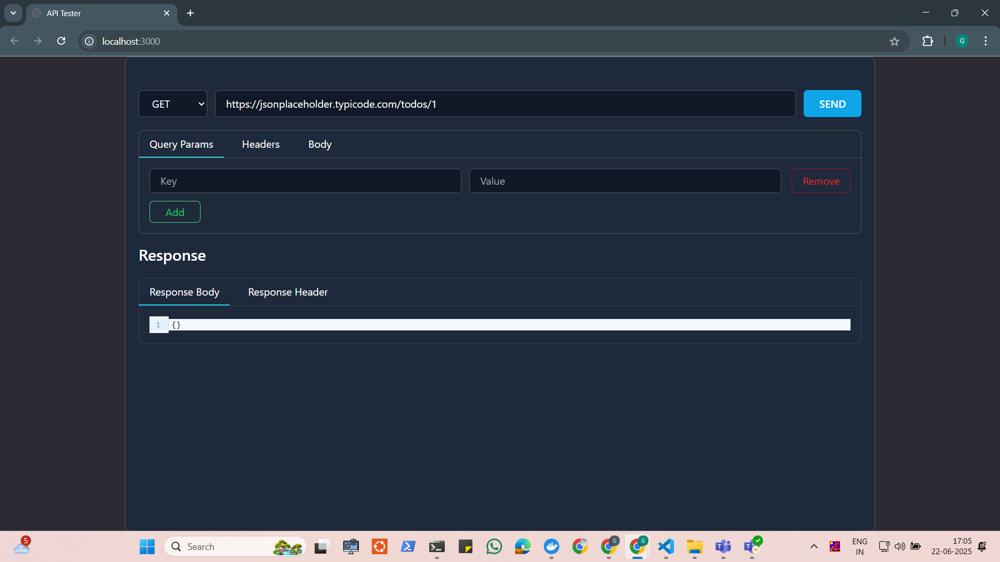
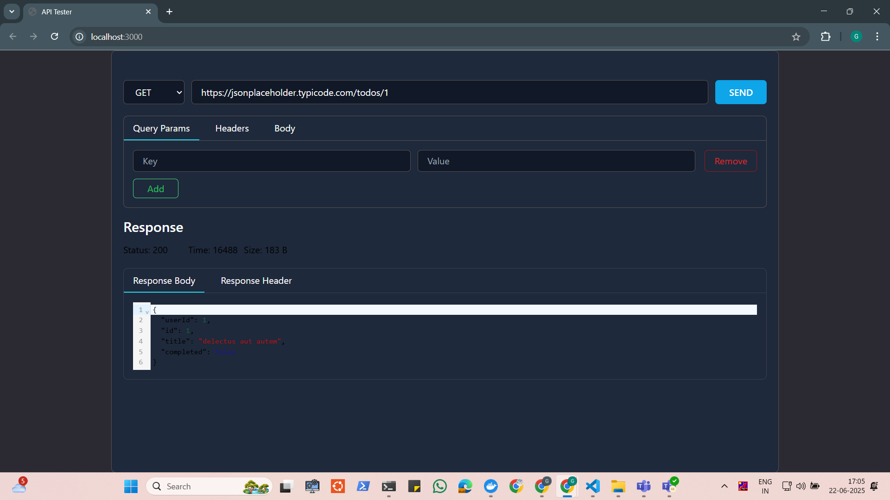
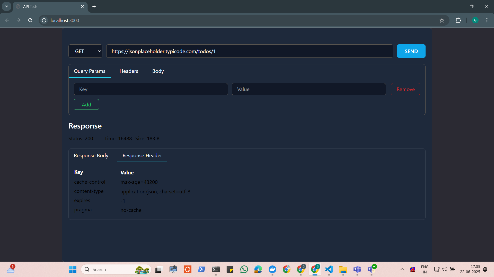

# API Tester

A simple react web application to test api endpoints during development

## To run this locally

1. Clone this repo on your local machine<br>
   ```git clone https://github.com/ganeshsprofessional/api-tester.git```<br>
2. Navigate to the directory and run <br>
```npm i```<br>
3. Run the project<br> ```npm start```<br>

## Screenshots

### Home Page



### Request with Response Body



### Response Header


